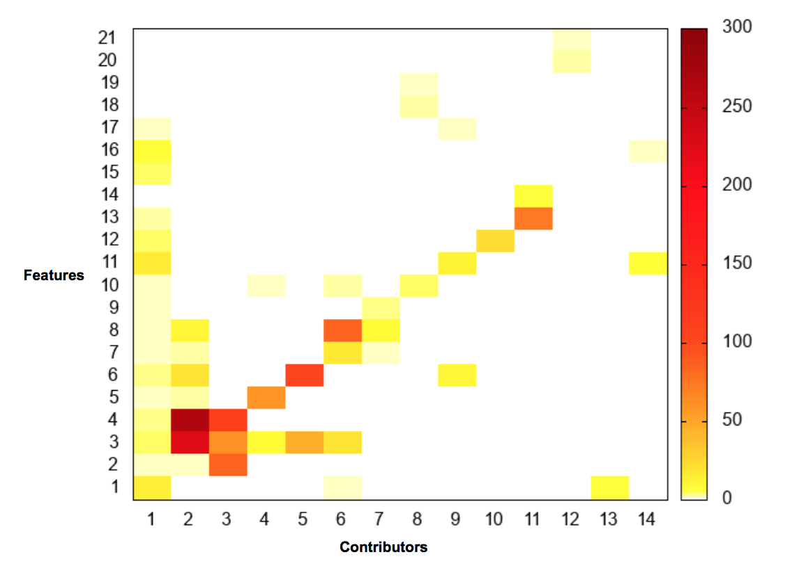
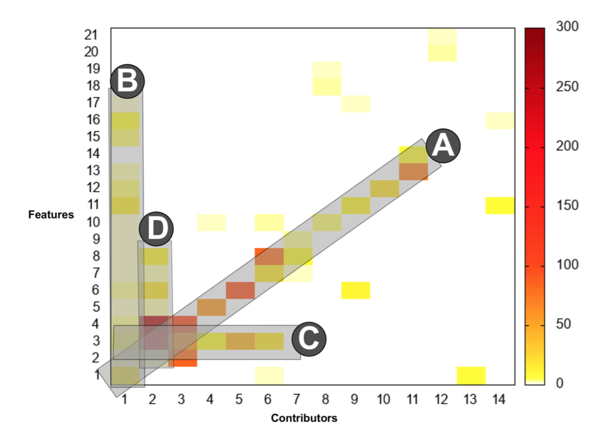

## Welcome to GitHub Pages

Paris Chrysos has made an interesting analysis of the contribution of each member for UPSat's developement, by analysing the team's git flow.

The collaboration matrix, a visualisation of the commits per feature and developer has revealed an interesting pattern about my role and the overall organisation of the team. Most of the developers focus in a single subsystem (EPS, COMMS, ADCS, OBC) while me and Apostolos Masiakos work on the TT&C software, that integrates all subsystem functionality. Through the use of the TT&C that connects we achieve code reusability and shortening testing time.

You can read the paper [Here](https://papers.ssrn.com/sol3/papers.cfm?abstract_id=3082301).

*Contribution matrix for UPSat [\[Chrysos\]](https://papers.ssrn.com/sol3/papers.cfm?abstract_id=3082301).*

 This work is licensed under a <a rel="license" href="http://creativecommons.org/licenses/by-nc-nd/4.0/">Creative Commons Attribution-NonCommercial-NoDerivatives 4.0 International License</a>.

